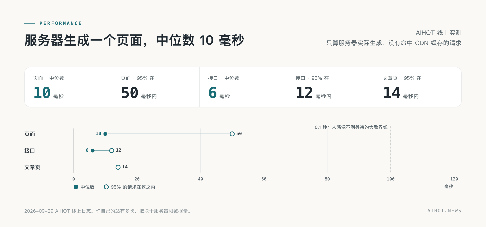
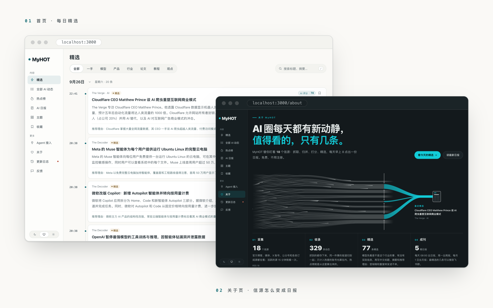

<p align="center">
  <picture>
    <source media="(prefers-color-scheme: dark)" srcset="docs/assets/banner-dark.png">
    
  </picture>
</p>

<p align="center">
  <a href="LICENSE"></a>
  
  
  
  <a href="https://github.com/shaojianlong/Unity3DHOT"></a>
</p>

<p align="center">
  <b>一个自己找热点、自己写日报的网站框架。</b><br>
  把信源换成你的，把精选标准换成你的 KnowHow，它就是你的行业热点站。
</p>

<p align="center">
  <a href="#跑起来">跑起来</a> ·
  <a href="docs/customize.md">改成你的行业</a> ·
  <a href="#它是怎么工作的">它是怎么工作的</a> ·
  <a href="#文档">文档</a> ·
  <a href="https://github.com/shaojianlong/Unity3DHOT/discussions">社区交流</a>
</p>

<br>

## 这是什么

Unity3DHOT 是一个面向游戏制作的行业热点站。它从引擎官方、图形技术博客、独立开发者和发行复盘中收集资料，用模型预筛、双次评分和结构化，生成中文标题与摘要；将同一件事的不同报道归成事件，按独立来源讨论计算热点，并发布日报、周报和月报。

这个仓库是它的引擎和框架：网站、后台、精选流程、聚簇和热度算法，**所有提示词的原文和入选门槛**，都在这里。

## 为什么开源

这半年，很多做法律、做 HR、做金融、做贵金属的朋友问我，能不能也给他们的行业做一个。

我做不了。我不懂你们的行业，不知道哪些信源有用，也不知道什么样的消息，对你们来说才叫热点。

但你们懂。

既然我没办法满足所有人，那就把火种交到大家自己手上。

## 说在前面

- **我不是专业的开发者。** 我是设计师出身，半年前还看不太懂代码。这套代码是我和 AI 一起重写的，比以前干净了很多，但一定还有写得不好的地方。发现问题欢迎提 Issue，我不一定能很快回复，先说声抱歉。
- **这是 Unity3DHOT 的行业配置。** 框架代码保留通用的采集、筛选、归组和发布能力；游戏制作分类、提示词、候选信源和报告文案在 `industry/` 与 `site/` 中维护。
- **候选信源需要逐个试抓。** 首次配置提供 Unity、GPUOpen、NVIDIA Developer、Blender、Godot 和独立开发复盘入口；启用前应检查正文、日期、来源权限和重复抓取结果。
- **商业表现和技术效果分开记录。** 热点反映讨论范围，不等于销量或利润；性能结论保留硬件、版本和测试场景。

## 它是怎么工作的

<picture>
  <source media="(prefers-color-scheme: dark)" srcset="docs/assets/how-dark.png">
  
</picture>

一条资料从信源进来，先判重，再预筛；可能重要的独立打两次分，写好中文标题和摘要，和别的报道聚成事件，算进热度。分数过了门槛、又不是精选里已有新闻的重复，才进精选；日报按规则编出当天要闻，周报、月报再从日报里汇编。每一步的提示词都在 [`industry/prompts/`](industry/prompts/)，改标准不用改代码。详见 [精选与校准](docs/selection.md)。

### 聚簇与热点

<picture>
  <source media="(prefers-color-scheme: dark)" srcset="docs/assets/cluster-dark.png">
  
</picture>

同一件事，Unity 官方发一篇、技术媒体转述、开发者分享实测，读者只需要看到一次。Unity3DHOT 把它们聚成一个**事件**：先用标题摘要的向量（没配向量服务时比文字重合度）在最近两周里找候选，再让模型判断是同一次发布、后续实测，还是不同项目；拿不准的合并，写入前再让模型复核一遍（复核可以单独换一家模型，设 `GROUP_REVIEW_MODEL`）。

**热度**按事件算，不按文章算：48 小时内，每个独立来源只算一次，24 小时减半。重复抓取不会多算，一家媒体发十篇也只算一次，所以排在前面的，是真正有很多人在说的事。

### 速度

<picture>
  <source media="(prefers-color-scheme: dark)" srcset="docs/assets/perf-dark.png">
  
</picture>

## 你会得到什么

| | |
|---|---|
| **六种信源** | RSS、网页列表、JSON 接口、X 账号、微信公众号，以及你自己脚本推送进来的内容。信源分三级（官方一手、官方账号与准官方、媒体与个人），各级入选门槛不同；抓取频率按产出自动调整 |
| **精选** | 预筛，同一份评分标准独立打两次分，再按信源分级的门槛决定入选；同一条新闻只占一条，换个说法的重复不进。提示词和门槛全部公开，全部可以改；用你自己标注的样本在 SelectBench 里校准 |
| **写作** | 中文标题、答案先行的摘要、推荐理由，外文全文翻译；分类、标签和新闻事实单独抽取；防止模型把原文没提到的公司写进标题 |
| **聚簇** | 不同来源报道的同一件事聚成一个事件，后续进展挂在同一个事件下，事件页有综述；进展和报道时间线可一起切换“最新在前”或“最早在前”；人工改过的归属不会被覆盖 |
| **热点** | 按事件算热度：独立来源越多越靠前，X 上的讨论也算进来；和 6 小时前比，涨得快的标上升，新出现的标“新” |
| **日报、周报、月报** | 每天出日报（默认 08:00），按规则编出当天要闻：一件事一条，报过的事只在有新进展时跟进，不调模型。每周一出周报、每月 1 日出月报（默认 10:00、10:30），从日报里汇编，模型只写总述和栏目导读。几点出刊在 `site/site.ts` 的 `EDITION_TIMES` 里改 |
| **主题与搜索** | 公司、方向、内容形态三类主题页；标题摘要搜索和全文相关搜索 |
| **给 Agent 用** | RSS（精选、全部、全文、日报、周报、月报）、公开 API、MCP、Agent Markdown、`llms.txt`，同一份内容给人看也给 Agent 用 |
| **后台** | 信源管理与试抓、内容诊断、精选评测、每一步单独换模型、付费服务的预算熔断、运行记录与告警 |

## 看一眼

<picture>
  <source media="(prefers-color-scheme: dark)" srcset="docs/assets/shots-dark.png">
  
</picture>

<p align="center"><sub>截图来自本地站。正式部署前请替换自己的图标、站名和候选信源。</sub></p>

## 跑起来

想创建自己的独立站点，可以直接克隆 [Unity3DHOT](https://github.com/shaojianlong/Unity3DHOT)，在本地完成行业配置后推送到自己的仓库，再由云端拉取部署。

需要 [Docker](https://docs.docker.com/get-started/get-docker/)、[Node.js 24](https://nodejs.org/en/download)（运行 `init-env` 生成配置要用），和一个 OpenAI 兼容的模型 API Key（DeepSeek、千问、智谱都可以）。

`init-env` 默认按 DeepSeek 配置。用千问、智谱等别家，照 `.env.example` 里的例子改 `.env` 的 `LLM_BASE_URL`、`LLM_MODEL` 和 `LLM_EXTRA_JSON`；用推理模型（先想再答）时，还要设 `LLM_REASONING_TOKENS` 给推理留出输出额度。

```bash
git clone https://github.com/shaojianlong/Unity3DHOT.git unity3dhot
cd unity3dhot
node scripts/init-env.ts --llm-key <你的模型 API Key>
docker compose up -d --build
```

打开 <http://localhost:3000>。后台在 `/admin`，管理员密码在 `.env` 的 `ADMIN_PASSWORD` 里。一两分钟后开始有内容，第一次导入的资料大约半小时处理完。

机器上没有 Node、服务器在中国大陆、要配域名和 HTTPS，或者不用 Docker、直接在 Linux、macOS 上跑（Windows 用 WSL2），见 [部署](docs/deploy.md)。

站点跑起来后，打开 `/agent` 可以复制 MCP、RSS 或 API 的接入方式；只能读网页的 Agent 从 `/api/v1/agent` 开始；接口说明在 `/openapi-v1.json`。

## 把它改成你的行业

最省事的办法：打开你的 Agent（Claude Code、Codex 都可以），把这个仓库交给它，然后说：

```text
请读 AGENTS.md 和 docs/customize.md，把这个站改成「XX 行业」的热点站。
我关心的是：……（写你想盯的信源、你觉得什么消息重要、什么不重要，越具体越好）。
改完帮我跑 npm run typecheck、npm test 和 node scripts/smoke.ts，并告诉我还需要我自己决定哪些事。
```

要改的东西几乎都在 [`site/`](site/) 和 [`industry/`](industry/) 这两个文件夹里，代码基本不用动：

| 文件 | 改什么 |
|---|---|
| `site/site.ts` | 站名、行业词、出刊时间、首页文案、关于页、条目与日报周报月报上的说法、公开接口的分类 |
| `industry/taxonomy.ts`、`industry/topics.json` | 分类、标签、主题 |
| `industry/sources.json` | 首次启动时导入的信源 |
| `industry/prompts/` | 精选标准和写作要求。**你的行业 KnowHow，就写在这里** |
| `industry/selection.ts` | 入选门槛 |
| `site/models.ts` | 每一步默认用哪个模型（不改也行：都用 `.env` 里配的那一个） |
| `site/brand/`、`site/pages/`、`site/public/`、`site/changelog.json` | 图标与 Logo，使用规则和隐私说明，`robots.txt` 这类发布在网站根目录的文件，更新日志 |
| `modules/` | 框架里没有、只有你的站要的功能，做成模块放在这里，见 [架构](docs/architecture.md#模块) 的“模块” |

最值得花时间的是评分标准（`industry/prompts/selection-score.md`）和门槛：拿一两百条你自己标注过的资料，用 `scripts/eval-selection.ts` 跑一遍，看它选得准不准，再回去改。怎么做写在 [精选与校准](docs/selection.md) 里。

## 文档

| 文档 | 内容 |
|---|---|
| [把它改成你的行业](docs/customize.md) | 站名、分类、主题、信源、提示词、门槛、模型、品牌，一步一步来 |
| [信源](docs/sources.md) | 六种信源怎么配，分级和全文，抓取频率，旧文和存档，固定起点 `publishedAfter`，外部推送接口 |
| [精选与校准](docs/selection.md) | 一条资料怎么变成精选、怎么编进日报周报月报，怎么用自己的样本校准 |
| [事件归组与关系评测](docs/grouping.md) | 事件关系怎么判断，怎么用自己标注的成对样本评测 |
| [综述评测](docs/story-digest-evaluation.md) | 改事件综述提示词前，怎么在同一批事件上并排比较 |
| [部署](docs/deploy.md) | Docker、域名和 HTTPS、中国大陆、更新、备份、花多少钱，不用 Docker 时在 Linux、macOS（Windows 用 WSL2）上怎么跑 |
| [架构](docs/architecture.md) | 三个进程、几条不变的规则、目录、模块、数据库迁移、对外出口、测试 |

技术栈：Node.js 24 · TypeScript · React Router（服务端渲染）· Fastify · PostgreSQL · pg-boss · Tailwind CSS · Docker Compose。

## 交流与贡献

部署和使用问题到 [问答区](https://github.com/shaojianlong/Unity3DHOT/discussions/categories/q-a)，新想法到 [想法交流区](https://github.com/shaojianlong/Unity3DHOT/discussions/categories/ideas)，欢迎在 [作品展示区](https://github.com/shaojianlong/Unity3DHOT/discussions/categories/show-and-tell) 分享你做出的行业热点站。

发现 Bug 或有明确的功能建议，可以 [提交 Issue](https://github.com/shaojianlong/Unity3DHOT/issues/new/choose)。准备改代码前，先看 [贡献说明](CONTRIBUTING.md)；安全漏洞请走 [私密报告入口](SECURITY.md)。

## 最后

Unity3DHOT 从一个面向游戏制作的个人项目开始。

我不知道它会被改成什么样子，会走到多远的地方。但这可能就是开源最浪漫的地方。

剩下的路，就交给你们了。

<p align="right">—— 数字生命卡兹克</p>

## 许可

代码使用 [MIT 许可证](LICENSE)。Unity3DHOT 的品牌素材不在代码许可范围内。字体有自己的许可，见 [NOTICE](NOTICE)。

---

<sub>**In English:** Unity3DHOT is a game-development industry news site that collects engine, graphics, indie-development and publishing sources, lets a language model screen and score items, writes Chinese headlines and summaries, clusters reports about the same event, ranks topics by independent sources, and publishes daily, weekly and monthly briefings. The repository keeps the industry taxonomy, prompts and thresholds in editable files. The documentation is in Chinese.</sub>
